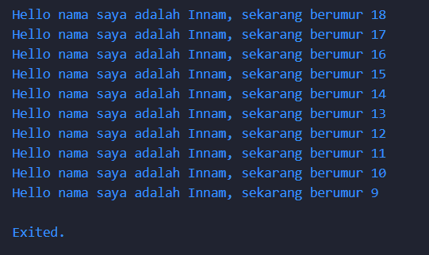

# Laporan Codelab #02 – Pengantar Bahasa Pemrograman Dart – Bagian 1

## Soal 1 : Pengulangan dalam dart
Source :
```
void main() {
  for (int i = 19; i >= 10; i--) {
    print('Hello nama saya adalah Innam, sekarang berumur ${i - 1}');
  }
}
```
Output:


Penjelasan :
Kode diatas menggunakan fungsi `main()` sebagai titik awal program. Di dalamnya terdapat sebuah loop `for` yang berjalan mundur dari angka 19 hingga 10.


## Soal 2: Pentingnya Memahami Bahasa Pemrograman Dart Sebelum Menggunakan Flutter

Memahami bahasa pemrograman Dart sangat penting sebelum mulai menggunakan framework Flutter karena:

- **Flutter dibangun menggunakan Dart**: Seluruh kode aplikasi Flutter ditulis dalam bahasa Dart.
- **Memudahkan pemahaman konsep dasar Flutter**: Pengetahuan Dart membantu memahami widget, state management, dan asynchronous programming.
- **Meningkatkan efisiensi dan keamanan kode**: Menguasai Dart memudahkan debugging, optimasi, dan penulisan kode yang lebih efisien serta aman.

---

## Soal 3 : Rangkuman Codelab

Dart adalah bahasa modern yang luar biasa, mendukung lintas platform, dan memiliki tujuan umum dengan terus meningkatkan fitur-fiturnya, membuatnya lebih kekinian dan fleksibel. Itulah sebabnya tim Flutter framework memilih bahasa Dart untuk digunakan.


## Fitur dan Karakteristik Bahasa Dart

- **Productive tooling**: Analisis kode, plugin IDE, dan ekosistem paket yang luas.
- **Garbage collection**: Manajemen memori otomatis.
- **Type annotations (opsional)**: Mendukung keamanan tipe dan konsistensi data.
- **Statically typed, type-safe, type inference**: Deteksi bug lebih awal saat kompilasi.
- **Portability**: Dapat dikompilasi ke JavaScript untuk web atau ke kode native (ARM/x86).

## Pentingnya Menguasai Dart dalam Konteks Flutter

- Semua aspek Flutter—kode aplikasi, plugin, manajemen dependensi—ditulis menggunakan Dart.
- Penguasaan dasar Dart meningkatkan produktivitas dan kenyamanan dalam pengembangan Flutter.

## Pengenalan Struktur Bahasa Dart

Dart memiliki sintaks yang mirip dengan bahasa pemrograman populer seperti C dan JavaScript, sehingga mudah dipahami bagi yang sudah memiliki pengalaman dengan bahasa tersebut. Dart menyediakan operator standar, tipe data bawaan, serta kontrol alur dan fungsi yang serupa dengan bahasa lain.

### Object Orientation
Dart adalah bahasa pemrograman berorientasi objek (OOP) yang mendukung fitur seperti encapsulation, inheritance, composition, abstraction, dan polymorphism. Objek dibuat dari class yang mendefinisikan field dan method.

### Operator di Dart
Operator di Dart adalah method khusus dalam class. Misalnya, `x == y` sama dengan memanggil `x.==(y)`. Semua tipe data di Dart merupakan objek, sehingga operator dapat diubah sesuai kebutuhan.

#### Operator Aritmatika
- `+` penjumlahan
- `-` pengurangan
- `*` perkalian
- `/` pembagian (hasil double)
- `~/` pembagian bilangan bulat
- `%` modulus
- `-expression` negasi

Shortcut operator: `+=`, `-=`, `*=`, `/=`, dan `~/=`.

#### Operator Increment dan Decrement
- `++var` atau `var++` untuk menambah 1
- `--var` atau `var--` untuk mengurangi 1

#### Operator Equality dan Relational
- `==` membandingkan kesamaan isi variabel
- `!=` membandingkan perbedaan isi variabel
- `>`, `<`, `>=`, `<=` untuk perbandingan relasional

Dart membandingkan isi variabel, bukan referensi memori, dan tidak membutuhkan operator `===` seperti JavaScript.

#### Operator Logika
- `!expression` negasi
- `||` logika OR
- `&&` logika AND

Dengan memahami struktur dasar ini, Anda dapat mulai menulis kode Dart dengan lebih percaya diri.

---

## Soal 4: Perbedaan Null Safety dan Late Variabel

### Null Safety
- Fitur Dart yang memastikan variabel tidak dapat bernilai `null` kecuali secara eksplisit diizinkan.
- Membantu mencegah error runtime akibat akses variabel `null`.

**Contoh:**
```dart
int? angka; // angka bisa null
int nilai = 10; // nilai tidak bisa null
```

### Late Variabel
- Digunakan untuk menunda inisialisasi variabel non-nullable.
- Variabel dengan modifier `late` harus diinisialisasi sebelum digunakan, tetapi tidak perlu langsung diinisialisasi saat deklarasi.

**Contoh:**
```dart
late String nama;
nama = 'Dart';
print(nama); // Output: Dart
```