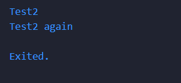

# Laporan Codelab 3 Pengantar Bahasa Pemrogramn Dart - Bagian 2
## Praktikum 1 : Menerapkan Control Flows 
<b>Langkah 1 :</b>

```
String test = "test2";
if (test == "test1") {
   print("Test1");
} else If (test == "test2") {
   print("Test2");
} Else {
   print("Something else");
}

if (test == "test2") print("Test2 again");
```
<br><br>
<b>Langkah 2 :</b> <br>
Setelah dilakukan run, kode tidak berjalan dikarenakan terdapat beberapa error. Setelah diperbaiki menjadi seperti,

```
void main() {
  String test = "test2";
  if (test == "test1") {
    print("Test1");
  } else if (test == "test2") {
   print("Test2");
  } else {
    print("Something else");
  }

  if (test == "test2") print("Test2 again");
}

```
Dan ketika di jalankan run, akan menghasilkan output di bawah <br>
<br>
Karena nilai dari variable test adalah test2 maka program hanya akan menjalankan blok percabangan yang kondisinya bernilai test2. <br><br>
<b>Langkah 3 :</b> <br>

```
String test = "true";
if (test) {
   print("Kebenaran");
}
```
Pada awalnya terjadi error dikarenakan tipe data dari test adalah string sedangkan yang dapat digunakan sebagai kondisi harusnya boolean tanpa diikuti tanda petik "...", setelah di betulkan kode akan menjadi seperti dibawah,

```
bool test2 = true;
  if (test2) {
    print("Kebenaran");
  }
```
dan menghasilkan output seperti ini<br>
<br>

## Praktikum 2 : Menerapkan Perulangan

<b>Langkah 1 :</b>

```
while (counter < 33) {
  print(counter);
  counter++;
}
```
<br><br>
<b>Langkah 2 :</b> <br>
Ketika dijalankan awalnya program akan error dikarenakan variable counter belum diinisiasikan, setelah diperbaiki kode akan menjadi seperti

```
while (counter < 33) {
    print(counter);
    counter++;
  }
```
yang menghasilkan output berikut <br>
<br>
Program tersebut menjalankan perulangan yang dimulai dari 0 (karena inisiasi variabel counter saya adalah 0) hingga 32 karena dalam kondisi perulangan counter harus kurang dari 33. Dalam hal ini program akan mencetak nilai dari counter, setelah itu nilai counter akan ditambah satu di tiap perulangan dan berhenti ketika nilai mencapai 32. <br>
<br>
<b>Langkah 3 : </b>
```
do {
  print(counter);
  counter++;
} while (counter < 77);
```

Kode diatas menghasilkan output berikut <br>
 <br>
Perulangan akan dilakukan sekali dan kemudian akan diulangi hingga nilai counter menjadi 76 dikarenakan kondisi dalam perulangan nilai counter tidak boleh melebihi 77.

## Praktikum 3 : Menerapkan Perulangan
<b>Langkah 1 :</b><br>

```
for (Index = 10; index < 27; index) {
  print(Index);
}
```
<br><br>
<b>Langkah 2 :</b><br>
 
 Kode tersebut menghasilkan error dikarenakan variabel index belum di inisiasi dalam for  serta belum ada notasi ++ untuk menambah nilai index, setelah dibetulkan kode akan menjadi,

 ```
 for (int index = 10; index < 27; index++) {
    print(index);
 }
 ```
 yang menghasilkan output <br>
  <br>
 Perulangan akan mecetak nilai index yang dimulai dari 10 dan akan berhenti jika nilai index mencapai 26 dikarenakan kondisi perulangan kurang dari 27
 <br><br>
<b>Langkah 3 :</b><br>

```
If (Index == 21) break;
Else If (index > 1 || index < 7) continue;
print(index);
```
Kode diatas akan menghasilkan akan menghasilkan error dikarenakan if-else belum lowercase dan variabel index harus sesuai dengan yang diinisiasi di kondisi for, setelah dibetulkan kode akan menjadi seperti ini, 

```
for (int index = 10; index < 27; index++) {
    if (index == 21) break;
    else if (index > 1 || index < 7) continue;
    print(index);
  }
```

output yang dihasilkan dari kode diatas adalah <br>
<br>
Program tidak menghasilkan output apapun karena terdapat konsisi jika index lebiih dari 1 maka akan continue dan perulangan berhenti di index 21.

## Tugas
Buatlah sebuah program yang dapat menampilkan bilangan prima dari angka 0 sampai 201 menggunakan Dart. Ketika bilangan prima ditemukan, maka tampilkan nama lengkap dan NIM Anda. <br>

```
void main() {
  for (int index = 0; index <= 201; index++) {
    bool prima = true;
    if (index == 0 || index == 1) {
      prima = false;
    } else if (index > 1) {
      for (int i = 2; i <= index / 2; i++) {
        if (index % i == 0) {
          prima = false;
          break;
        }
      }
    }

    if (prima) {
      print("$index - Innama Maesa Putri - 2341720235");
    } else {
      print("$index");
    }
  }
}


```
<br>
Output : <br>
