# Laporan Codelab 4 Pengantar Bahasa Pemrogramn Dart - Bagian 3
## Praktikum 1 :  Eksperimen Tipe Data List

Langkah 1 : <br>

```
var list = [1, 2, 3];
assert(list.length == 3);
assert(list[1] == 2);
print(list.length);
print(list[1]);

list[1] = 1;
assert(list[1] == 1);
print(list[1]);
```

<br>
Langkah 2 : <br>
Output : <br>
<br>
<br>

Langkah 3 : <br>

```
void main() {
  final list = List<String?>.filled(5, null);
  list[1] = "Innama Maesa Putri";
  list[2] = "2341720235"; 
  print(list);
}
```
Output : <br>

<br>

- Program ini membuat list dengan 5 elemen.
- Secara default, semua isi null.
- Lalu diisi pada indeks 1 dan 2 dengan nama dan NIM.
- Output menampilkan list lengkap, termasuk elemen yang masih null.
<br>

## Praktikum 2 :  Eksperimen Tipe Data Set

Langkah 1 : <br>

```
var halogens = {'fluorine', 'chlorine', 'bromine', 'iodine', 'astatine'};
print(halogens);
```

<br>
Langkah 2 : <br>
Output : <br>
<br>
<br>

Langkah 3 : <br>

```
var names1 = <String>{};
Set<String> names2 = {}; // This works, too.
var names3 = {}; // Creates a map, not a set.

print(names1);
print(names2);
print(names3);
```
Output : <br>

<br>

Ketiga baris menampilkan tanda {}, tetapi artinya berbeda:
- names1 → Set<String> kosong
- names2 → Set<String> kosong
- names3 → Map<dynamic, dynamic> kosong
<br>

## Praktikum 3 :  Eksperimen Tipe Data Maps

Langkah 1 : <br>

```
var gifts = {
  // Key:    Value
  'first': 'partridge',
  'second': 'turtledoves',
  'fifth': 1
};

var nobleGases = {
  2: 'helium',
  10: 'neon',
  18: 2,
};

print(gifts);
print(nobleGases);
```

<br>
Langkah 2 : <br>
Output : <br>
<br>
<br>

Langkah 3 : <br>

```
  var gifts = {
    // Key:    Value
    'first': 'partridge',
    'second': 'turtledoves',
    'fifth': 1,
  };

  var nobleGases = {2: 'helium', 10: 'neon', 18: 2};

  print(gifts);
  print(nobleGases);

  var mhs1 = Map<String, String>();
  gifts['first'] = 'partridge';
  gifts['second'] = 'turtledoves';
  gifts['fifth'] = 'golden rings';

  mhs1['name'] = 'Innama Maesa Putri';
  mhs1['nim'] = '2341720235';

  var mhs2 = Map<int, String>();
  nobleGases[2] = 'helium';
  nobleGases[10] = 'neon';
  nobleGases[18] = 'argon';
  mhs2[4] = 'Innama Maesa Putri';
  mhs2[5] = '2341720235';

  print(mhs1);
  print(mhs2);
```
Output : <br>

<br>

1. gifts  
   - Tipe: `Map<String, dynamic>`  
   - Isi awal: `{first: partridge, second: turtledoves, fifth: 1}`  

2. nobleGases  
   - Tipe: `Map<int, dynamic>`  
   - Isi awal: `{2: helium, 10: neon, 18: 2}`  

3. `print(gifts)`  
   - Menampilkan isi awal dari `gifts`.  

4. `print(nobleGases)`  
   - Menampilkan isi awal dari `nobleGases`.  

5. `var mhs1 = Map<String, String>();`  
   - Membuat `Map` kosong dengan key `String` dan value `String`.  
   - `gifts` kemudian diperbarui menjadi: `{first: partridge, second: turtledoves, fifth: golden rings}`  
   - `mhs1` diisi data baru: `{name: Innama Maesa Putri, nim: 2341720235}`  

6. `var mhs2 = Map<int, String>();`  
   - Membuat `Map` kosong dengan key `int` dan value `String`.  
   - `nobleGases` kemudian diperbarui menjadi: `{2: helium, 10: neon, 18: argon}`  
   - `mhs2` diisi data baru: `{4: Innama Maesa Putri, 5: 2341720235}`  

7. `print(mhs1)`  
   - Menampilkan isi `mhs1`: `{name: Innama Maesa Putri, nim: 2341720235}`  

8. `print(mhs2)`  
   - Menampilkan isi `mhs2`: `{4: Innama Maesa Putri, 5: 2341720235}`  

<br>

## Praktikum 4 :  Eksperimen Tipe Data List: Spread dan Control-flow Operators

Langkah 1 : <br>

```
void main() {
  var list1 = [1, 2, 3];
  var list2 = [0, ...list1];
  print(list1);
  print(list2);
  print(list2.length);
}
```

<br>
Langkah 2 : <br>
Output : <br>
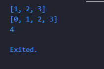<br>
<br>

Langkah 3 : <br>

```
void main() {
  var list1 = [1, 2, 3];
  var list2 = [0, ...list1];
  print(list1);
  print(list2);
  print(list2.length);
  var list = [1, 2, null];
  print(list);
  var list3 = [0, ...?list];
  print(list3.length);


  var nimDigits = [2, 3, 4, 1, 7, 2, 0, 2, 3, 5]; 
  var nimList = [...nimDigits];
  print(nimList);
}
```
Output : <br>

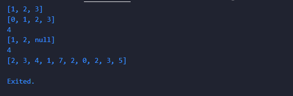<br>
1. `var list1 = [1, 2, 3];`  
   - Membuat list dengan isi `[1, 2, 3]`.  

2. `var list2 = [0, ...list1];`  
   - Menggunakan operator spread (`...`) untuk menyalin isi `list1` ke dalam list baru `list2`.  
   - Hasil: `list2 = [0, 1, 2, 3]`.  

3. `print(list1);`  
   - Menampilkan `[1, 2, 3]`.  

4. `print(list2);`  
   - Menampilkan `[0, 1, 2, 3]`.  

5. `print(list2.length);`  
   - Menampilkan panjang list `list2`.  
   - Panjang = `4` karena berisi 4 elemen.  

6. `var list = [1, 2, null];`  
   - Membuat list yang mengandung nilai `null`.  
   - Hasil: `[1, 2, null]`.  

7. `print(list);`  
   - Menampilkan `[1, 2, null]`.  

8. `var list3 = [0, ...?list];`  
   - Menggunakan `...?` (null-aware spread operator).  
   - Artinya, jika `list` tidak `null`, maka elemen-elemen `list` dimasukkan ke dalam `list3`.  
   - Hasil: `list3 = [0, 1, 2, null]`.  

9. `print(list3.length);`  
   - Menampilkan panjang list `list3`.  
   - Panjang = `4` karena berisi `[0, 1, 2, null]`.  

10. `var nimDigits = [2, 3, 4, 1, 7, 2, 0, 2, 3, 5];`  
    - Membuat list angka yang merepresentasikan NIM: `[2, 3, 4, 1, 7, 2, 0, 2, 3, 5]`.  

11. `var nimList = [...nimDigits];`  
    - Menyalin semua elemen dari `nimDigits` ke list baru `nimList`.  
    - Hasil: `nimList = [2, 3, 4, 1, 7, 2, 0, 2, 3, 5]`.  

12. `print(nimList);`  
    - Menampilkan `[2, 3, 4, 1, 7, 2, 0, 2, 3, 5]`.  

<br><br>

Langkah 4  <br>

```
 bool promoActive = false;
  var nav = ['Home', 'Furniture', 'Plants', if (promoActive) 'Outlet'];
  print(nav);
```

Output True:
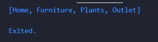 <br>
<br>

Output False:
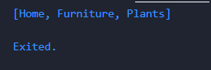 <br>
<br>

1. `bool promoActive = false;`  
   - Mendefinisikan variabel `promoActive` dengan tipe `bool` (boolean).  
   - Nilai awal: `false`.  

2. `var nav = ['Home', 'Furniture', 'Plants', if (promoActive) 'Outlet'];`  
   - Membuat list bernama `nav`.  
   - Isi awal list: `'Home'`, `'Furniture'`, `'Plants'`.  
   - Menggunakan **collection if**: `'Outlet'` hanya akan ditambahkan ke dalam list jika `promoActive == true`.  
   - Karena `promoActive == false`, maka `'Outlet'` tidak dimasukkan.  
   - Hasil akhir `nav = ['Home', 'Furniture', 'Plants']`.  

3. `print(nav);`  
   - Menampilkan isi list `nav`.  
   - Output: `['Home', 'Furniture', 'Plants']`.  

<br><br>

Langkah 5  <br>

```
  var login = 'Staff';
  var nav2 = [
    'Home',
    'Furniture',
    'Plants',
    if (login case 'Manager') 'Inventory',
  ];
  print(nav2);
```

Output Manager :
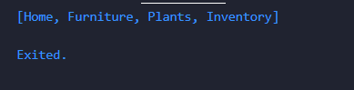 <br>
<br>

Output Staff :
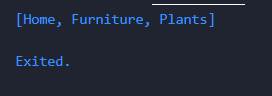 <br>
<br>

1. `var login = 'Staff';`  
   - Mendefinisikan variabel `login` dengan nilai `'Staff'`.  
   - Tipe data otomatis dikenali sebagai `String`.  


<br><br>

Langkah 6  <br>

```
var listOfInts = [1, 2, 3];
var listOfStrings = ['#0', for (var i in listOfInts) '#$i'];
assert(listOfStrings[1] == '#1');
print(listOfStrings);
```

Output :
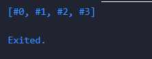 <br>
<br>

- Manfaat **Collection For**
- Digunakan untuk **membuat list secara dinamis** berdasarkan data dari list lain.  
- Membantu menulis kode yang lebih **ringkas dan mudah dibaca** dibandingkan membuat list dengan loop terpisah.  
- Cocok untuk menggabungkan nilai statis dengan hasil iterasi dalam satu list.  

## Praktikum 5 : Eksperimen Tipe Data Records

Langkah 1 : <br>

```
 var record = ('first', a: 2, b: true, 'last');
  print(record);
```

Langkah 2 : <br>
Output : <br>
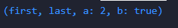 <br><br>

Langkah 3 :

```
void main() {
  print(tukar((10, 20)));
}

(int, int) tukar((int, int) record) {
  var (a, b) = record;
  return (b, a);
}
```

Output : <br>
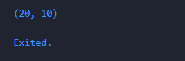 <br><br>

Langkah 4 :

```
 (String, int) mahasiswa = ('Innama Maesa Putri', 2341720235); 
  print(mahasiswa);
```

Output : <br>
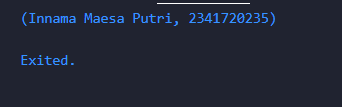 <br><br>


Langkah 5 :

```
var mahasiswa2 = ('first', a: 2, b: true, 'last');

print(mahasiswa2.$1); // Prints 'first'
print(mahasiswa2.a); // Prints 2
print(mahasiswa2.b); // Prints true
print(mahasiswa2.$2); // Prints 'last'
```

Output : <br>
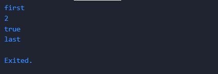 <br><br>

