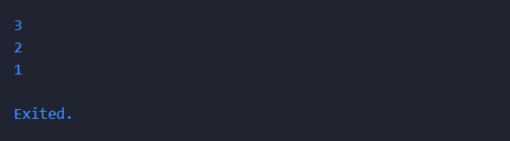
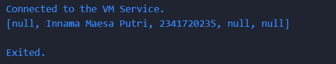
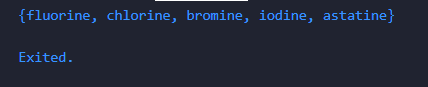
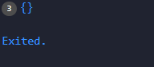
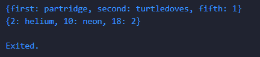
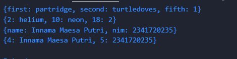

# Laporan Codelab 4 Pengantar Bahasa Pemrogramn Dart - Bagian 3
## Praktikum 1 :  Eksperimen Tipe Data List

Langkah 1 : <br>

```
var list = [1, 2, 3];
assert(list.length == 3);
assert(list[1] == 2);
print(list.length);
print(list[1]);

list[1] = 1;
assert(list[1] == 1);
print(list[1]);
```

<br>
Langkah 2 : <br>
Output : <br>
<br>
<br>

Langkah 3 : <br>

```
void main() {
  final list = List<String?>.filled(5, null);
  list[1] = "Innama Maesa Putri";
  list[2] = "2341720235"; 
  print(list);
}
```
Output : <br>

<br>

- Program ini membuat list dengan 5 elemen.
- Secara default, semua isi null.
- Lalu diisi pada indeks 1 dan 2 dengan nama dan NIM.
- Output menampilkan list lengkap, termasuk elemen yang masih null.
<br>

## Praktikum 2 :  Eksperimen Tipe Data Set

Langkah 1 : <br>

```
var halogens = {'fluorine', 'chlorine', 'bromine', 'iodine', 'astatine'};
print(halogens);
```

<br>
Langkah 2 : <br>
Output : <br>
<br>
<br>

Langkah 3 : <br>

```
var names1 = <String>{};
Set<String> names2 = {}; // This works, too.
var names3 = {}; // Creates a map, not a set.

print(names1);
print(names2);
print(names3);
```
Output : <br>

<br>

Ketiga baris menampilkan tanda {}, tetapi artinya berbeda:
- names1 → Set<String> kosong
- names2 → Set<String> kosong
- names3 → Map<dynamic, dynamic> kosong
<br>

## Praktikum 3 :  Eksperimen Tipe Data Maps

Langkah 1 : <br>

```
var gifts = {
  // Key:    Value
  'first': 'partridge',
  'second': 'turtledoves',
  'fifth': 1
};

var nobleGases = {
  2: 'helium',
  10: 'neon',
  18: 2,
};

print(gifts);
print(nobleGases);
```

<br>
Langkah 2 : <br>
Output : <br>
<br>
<br>

Langkah 3 : <br>

```
var gifts = {
    // Key:    Value
    'first': 'partridge_innama maesa putri',
    'second': 'turtledoves_2341720235',
    'fifth': 1,
  };

  var nobleGases = {2: 'helium', 10: 'neon', 18: 2};

  print(gifts);
  print(nobleGases);

  var mhs1 = Map<String, String>();
  gifts['first'] = 'partridge';
  gifts['second'] = 'turtledoves';
  gifts['fifth'] = 'golden rings';

  var mhs2 = Map<int, String>();
  nobleGases[2] = 'helium';
  nobleGases[10] = 'neon';
  nobleGases[18] = 'argon';
```
Output : <br>

<br>

1. gifts
- Tipe: Map<String, dynamic>
- Isi awal: {first: partridge_innama maesa putri, second: turtledoves_2341720235, fifth: 1}
2. nobleGases
- Tipe: Map<int, dynamic>
- Isi awal: {2: helium, 10: neon, 18: 2}
3. print(gifts) menampilkan isi awal dari gifts.
4. print(nobleGases) menampilkan isi awal dari nobleGases.
5. var mhs1 = Map<String, String>();
- Membuat Map kosong dengan key String dan value String.
- gifts kemudian diperbarui: {first: partridge, second: turtledoves, fifth: golden rings}
6. var mhs2 = Map<int, String>();
- Membuat Map kosong dengan key int dan value String.
- nobleGases kemudian diperbarui: {2: helium, 10: neon, 18: argon}
<br>
