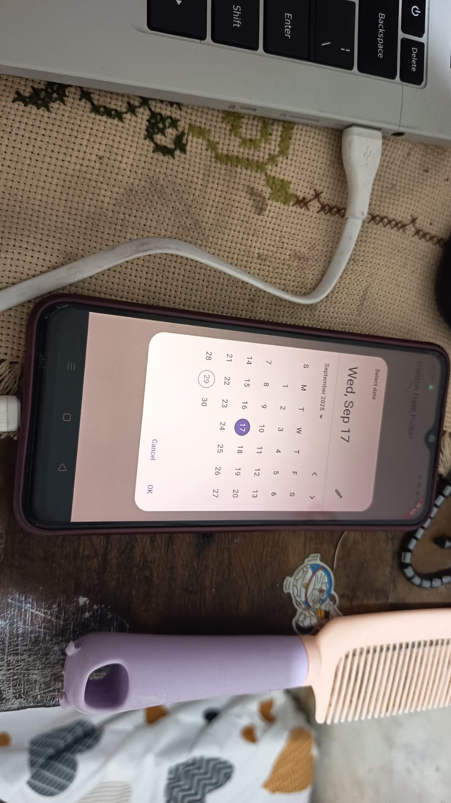
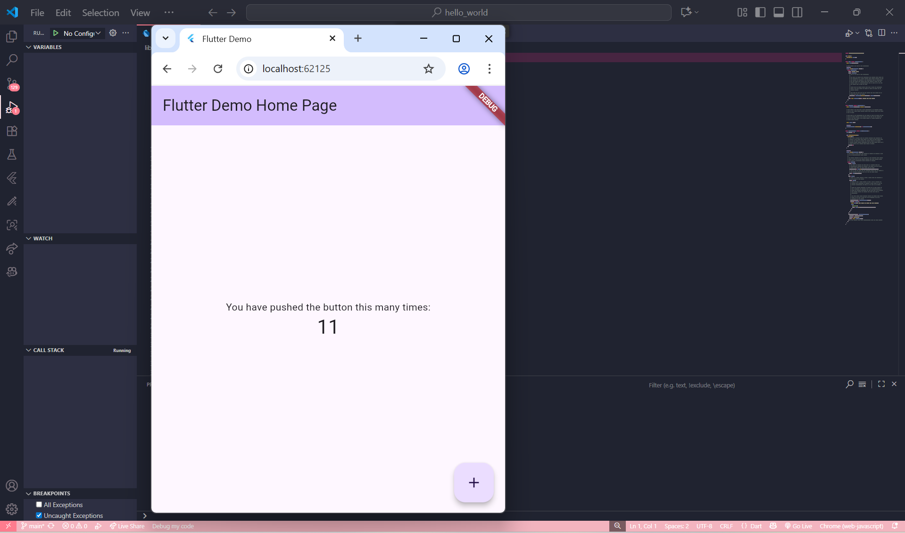
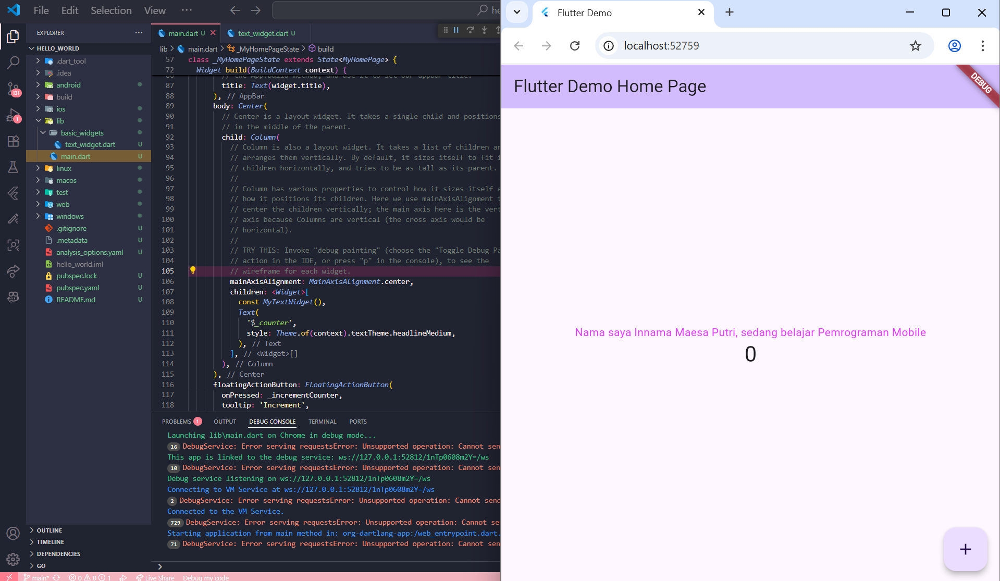
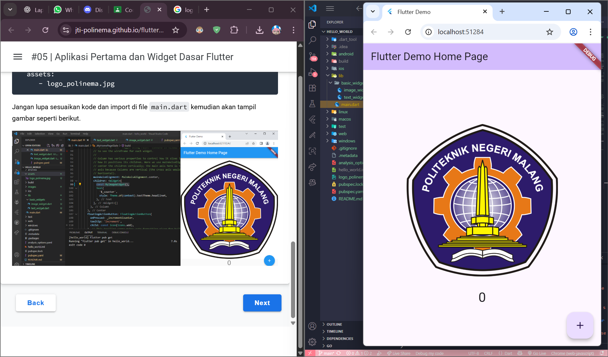
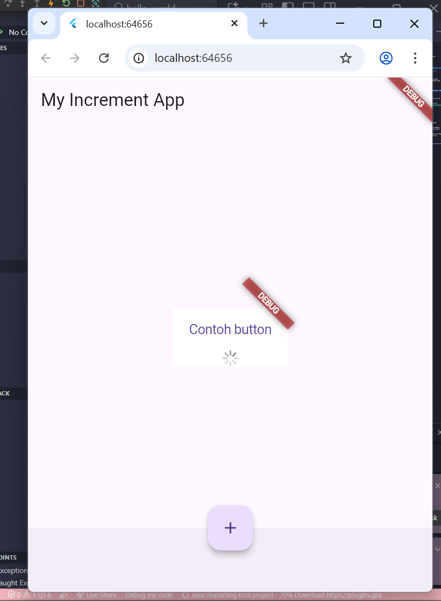
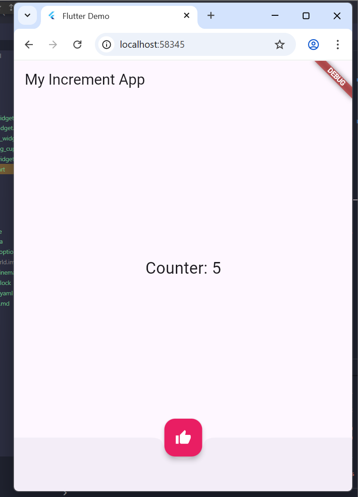
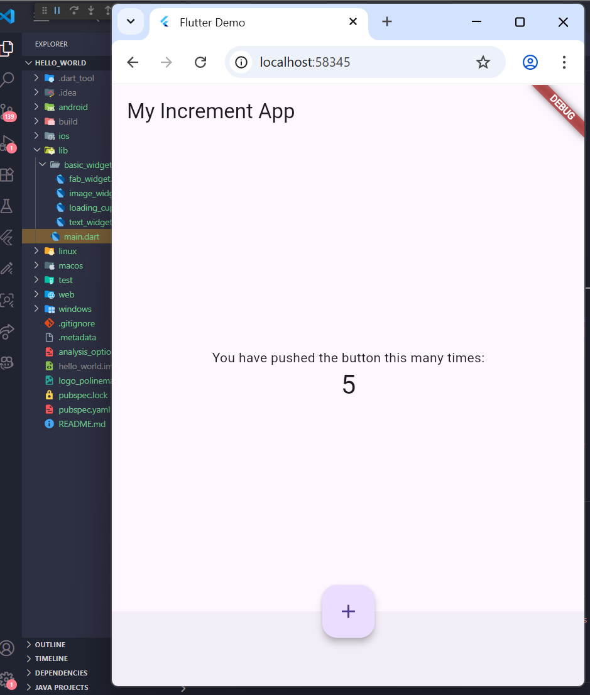
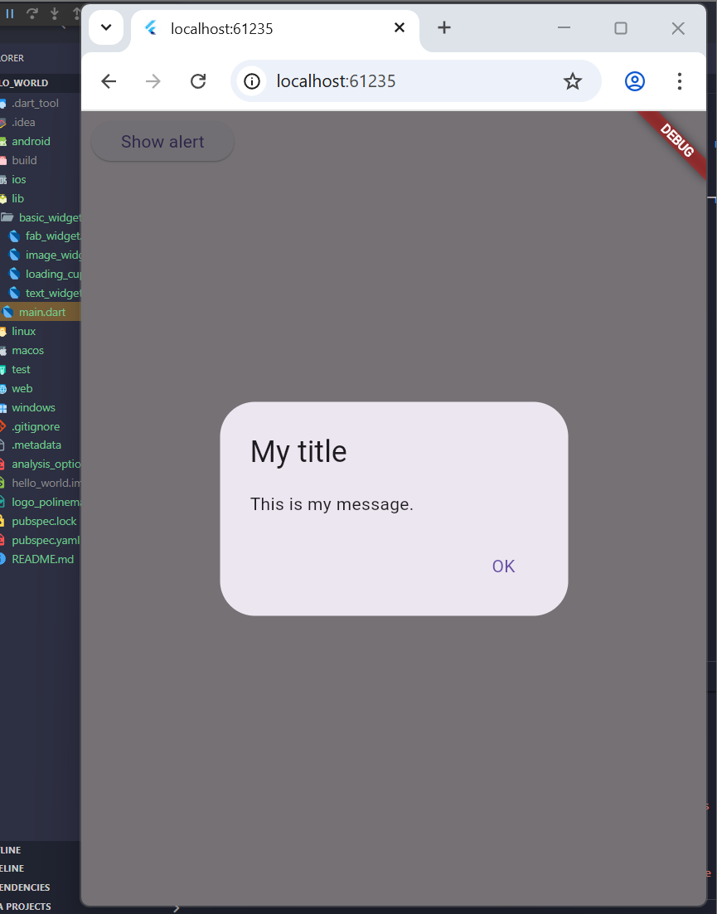
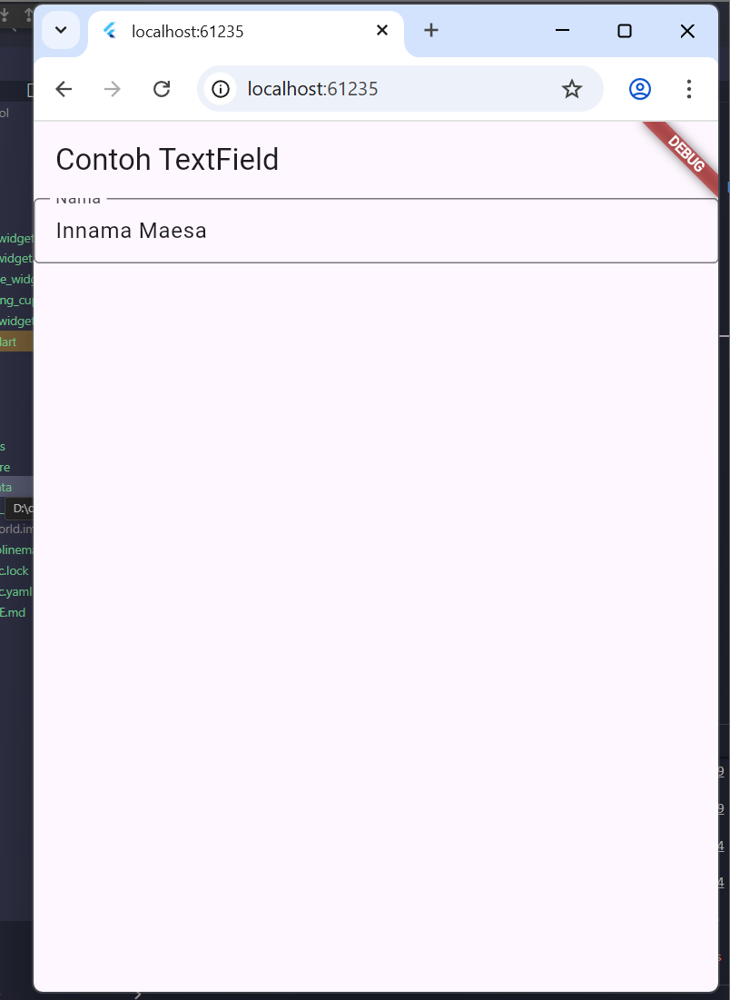
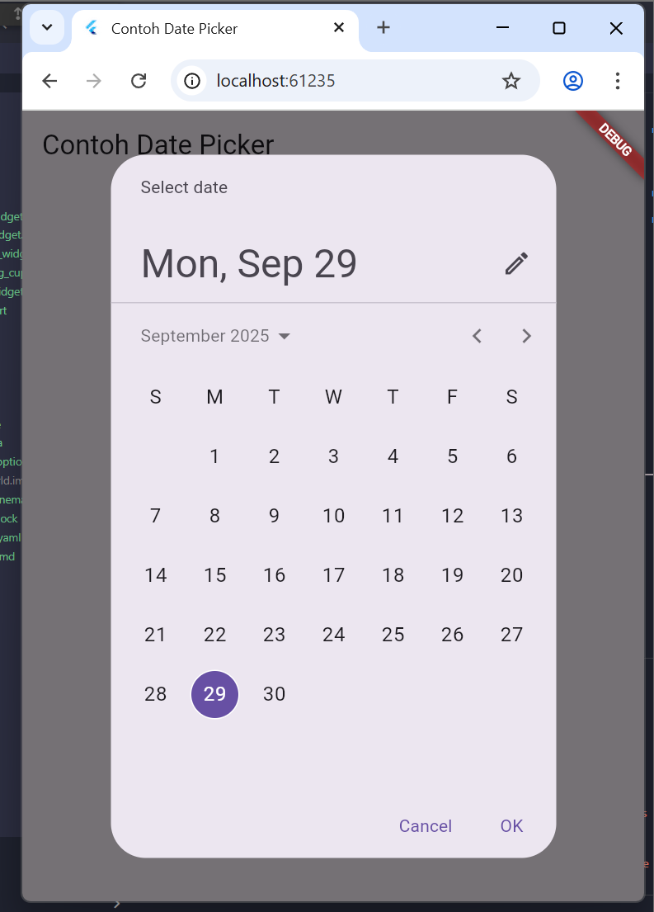

# Codelab 5 : Aplikasi Pertama dan Widget dasar Flutter

## Praktikum 2
(Untuk Praktikum 1 tidak ada dokumentasi karena hanya langkah dalam membuat project)  
Hasil jika dijalankan dalam device hp :  
 

## Praktikum 3 
Hasil langkah 12 :   
 

## Praktikum 4 
Hasil text widget :   
 
Hasil image widget :   
 

## Praktikum 5
Hasil cupertino button dan loading bar :   
 
Hasil floating action button :   
 
Hasil sacffold widget :   
 
Hasil dialog widget :   
 
Hasil input dan selection widget :   
 
Hasil date dan time pickers :   
 