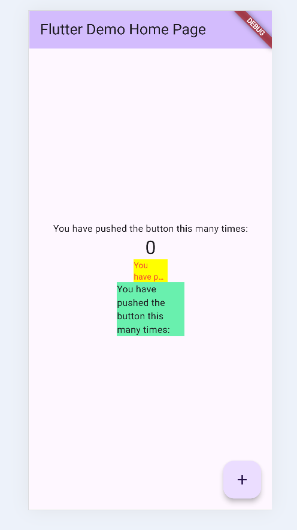

# Praktikum Codelab 7 : Manajemen Plugin

1. Selesaikan Praktikum tersebut, lalu dokumentasikan dan push ke repository Anda berupa screenshot hasil pekerjaan beserta penjelasannya di file README.md!
- Output : 
  

- Download plugin melalui terminal akan membuat pubsec.yaml memuat dependencies tersebut dalam project. Selanjutnya akan dilakukan import ke dalam file main.dart. Sehingga plugin auto_size_text berhasil membuat teks menjadi responsif terhadap ukuran tampilan, sedangkan widget Text bawaan tidak dapat menyesuaikan ukuran teks secara otomatis.

2. Jelaskan maksud dari langkah 2 pada praktikum tersebut!
- Langkah 2 bertujuan untuk menambahkan dependensi eksternal (plugin) dari pub.dev ke dalam project Flutter. Hal tersebut akan akan: Mengunduh paket auto_size_text dari repository pub.dev, menambahkan nama dan versi plugin ke file pubspec.yaml di bagian dependencies, memungkinkan Flutter untuk menggunakan fungsionalitas tambahan yang tidak disediakan secara bawaan, dalam hal ini kemampuan untuk menyesuaikan ukuran teks secara otomatis agar sesuai dengan lebar tampilan (responsive text size).

3. Jelaskan maksud dari langkah 5 pada praktikum tersebut!
- Langkah ini membuat widget RedTextWidget menjadi lebih fleksibel dengan menambahkan parameter text agar bisa menerima nilai string dari luar. Dengan langkah ini, error pada langkah 4 hilang karena plugin AutoSizeText sekarang sudah memiliki data teks yang harus ditampilkan.

4. Pada langkah 6 terdapat dua widget yang ditambahkan, jelaskan fungsi dan perbedaannya!
- Kedua Container digunakan untuk membandingkan hasil tampilan teks biasa dengan teks yang menggunakan plugin auto_size_text. RedTextWidget Menggunakan AutoSizeText, teks otomatis mengecil agar muat di dalam container yang lebarnya kecil (width: 50). Warna teks merah. Sedangkan Text biasa Menggunakan widget bawaan Flutter (Text), teks akan terpotong atau overflow jika tidak cukup ruang, meskipun lebarnya lebih besar (width: 100).

5. Jelaskan maksud dari tiap parameter yang ada di dalam plugin auto_size_text berdasarkan tautan pada dokumentasi ini !
- Plugin auto_size_textdigunakan untuk menyesuaikan ukuran teks secara otomatis agar tidak keluar dari batas tampilan. Berikut parameter-parameter yang digunakan dalam praktikum:

| Parameter | Fungsi |
|------------|--------|
| `text` | Teks yang akan ditampilkan dan disesuaikan ukurannya. |
| `style` | Mengatur gaya teks, termasuk warna (`Colors.red`) dan ukuran awal (`fontSize: 14`). |
| `maxLines` | Menentukan batas maksimal jumlah baris teks yang ditampilkan. Jika lebih dari 2 baris, teks akan dipotong. |
| `overflow` | Menentukan cara menangani teks yang melebihi batas `maxLines`. Nilai `TextOverflow.ellipsis` akan menambahkan tanda “…” di akhir teks. |

**Parameter tambahan (tidak digunakan di praktikum ini):**

| Parameter | Fungsi |
|------------|--------|
| `minFontSize` | Ukuran font minimum. |
| `maxFontSize` | Ukuran font maksimum. |
| `stepGranularity` | Tingkat perubahan ukuran font saat disesuaikan. |

6. Kumpulkan laporan praktikum Anda berupa link repository GitHub kepada dosen!