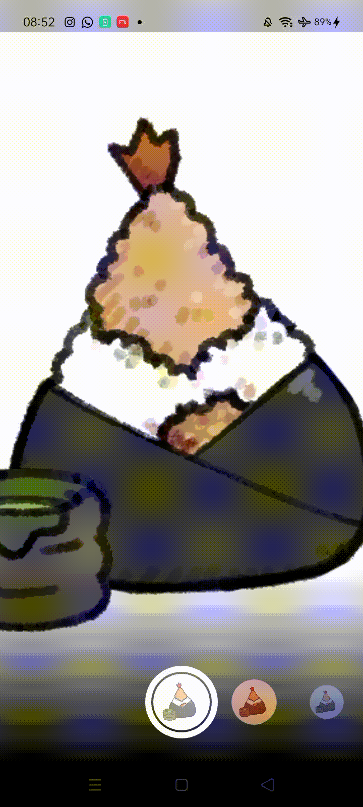

# Codelab 09 : Kamera

### Innama Maesa Putri - 16

## Praktikum 1 :


## Praktikum 2 :


## Hasil penggabungan : 


## 3. Jelaskan maksud `void async` pada praktikum 1

Dalam praktikum 1, penggunaan `void async` berarti bahwa fungsi tersebut bersifat **asinkron**.  
Kata kunci `async` digunakan agar fungsi dapat menjalankan proses **secara tidak bersamaan (non-blocking)** dengan fungsi lain.  

Dengan `async`, fungsi dapat menunggu hasil dari operasi yang memerlukan waktu — misalnya membuka kamera, membaca file, atau mengambil data dari internet — tanpa menghentikan eksekusi program utama.  
Untuk menunggu hasil dari proses asinkron, digunakan kata kunci `await`.  

Contoh:
```dart
void _takePicture() async {
  final image = await _cameraController.takePicture();
  setState(() {
    _imageFile = File(image.path);
  });
}
```
Pada contoh di atas, `await` digunakan untuk menunggu proses pengambilan gambar selesai sebelum melanjutkan ke baris berikutnya.

---

## 4. Jelaskan fungsi dari anotasi `@immutable` dan `@override`

### a. `@immutable`
Anotasi `@immutable` digunakan pada class Flutter (biasanya `Widget`) untuk menyatakan bahwa **objek dari class tersebut tidak dapat diubah setelah dibuat**.  
Artinya, semua properti di dalam class tersebut harus bersifat `final`.

Contoh:
```dart
@immutable
class FilterItem extends StatelessWidget {
  final Color color;
  const FilterItem({required this.color});

  @override
  Widget build(BuildContext context) {
    return Container(color: color);
  }
}
```
Jika class diberi anotasi `@immutable`, maka kita tidak boleh mengubah nilai `color` setelah objek dibuat.

### b. `@override`
Anotasi `@override` digunakan untuk **menandai bahwa suatu method menimpa (override)** method dari superclass-nya.  
Ini membantu memastikan bahwa method benar-benar ada di kelas induk dan memperjelas maksud kode bagi pembaca.

Contoh:
```dart
@override
Widget build(BuildContext context) {
  return Scaffold(
    appBar: AppBar(title: Text('Contoh')),
  );
}
```

Method `build()` di atas menimpa method `build()` milik superclass `StatelessWidget` atau `State`.
