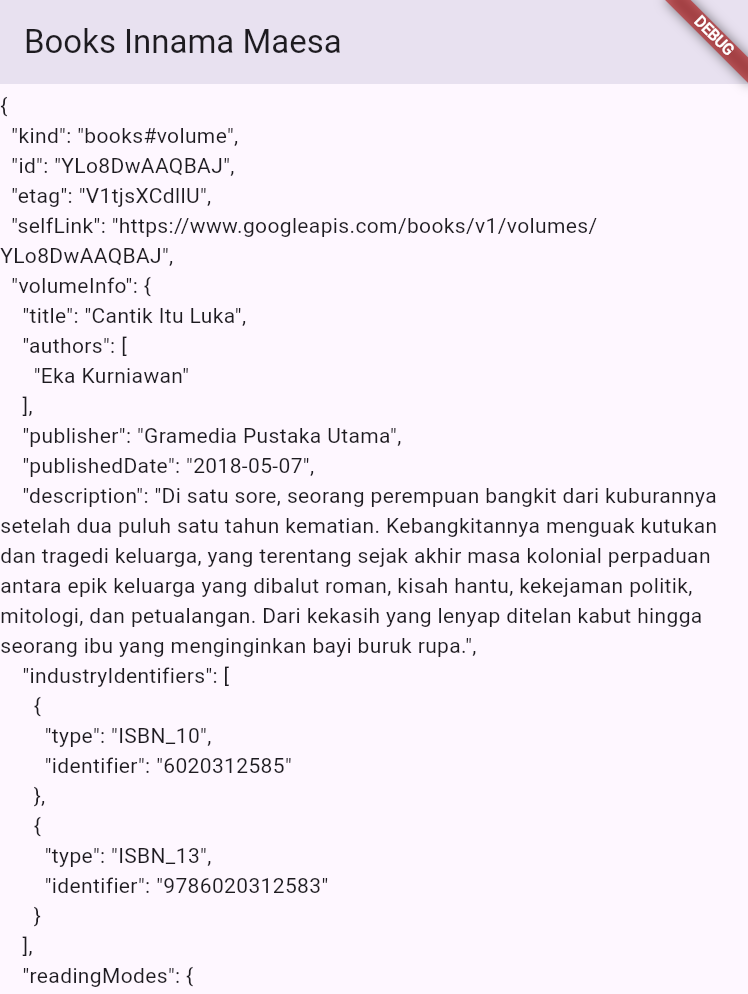
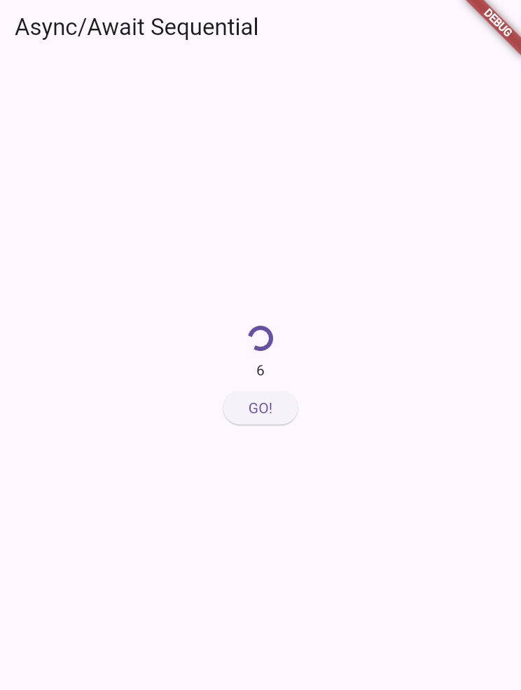
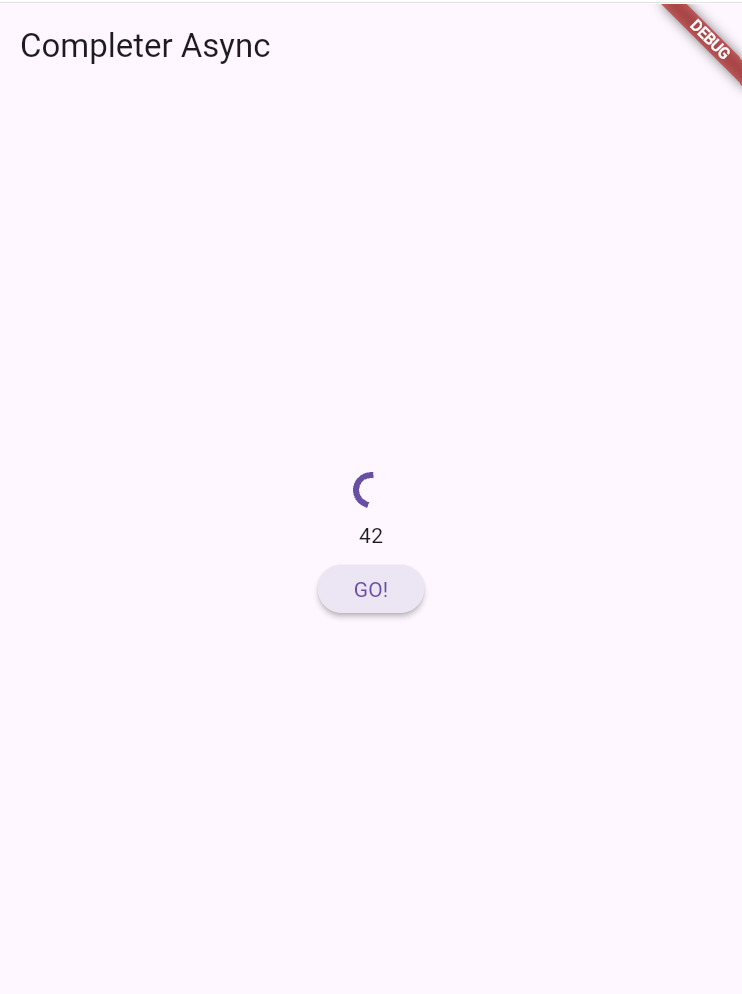
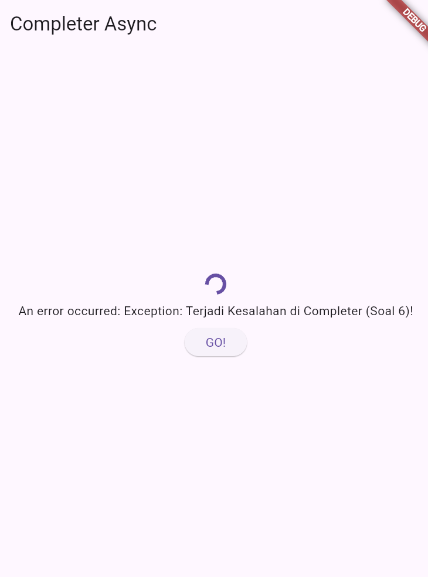
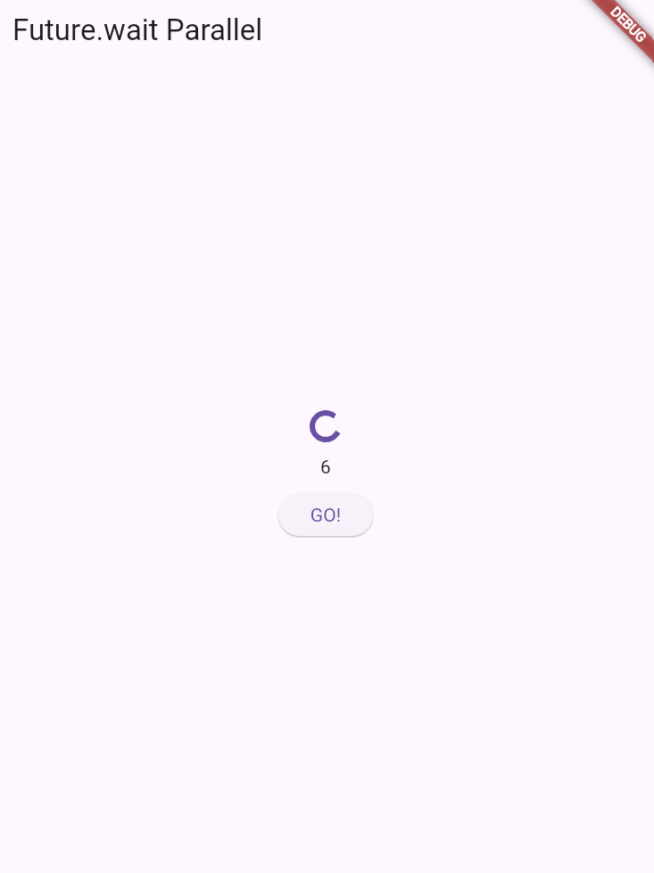
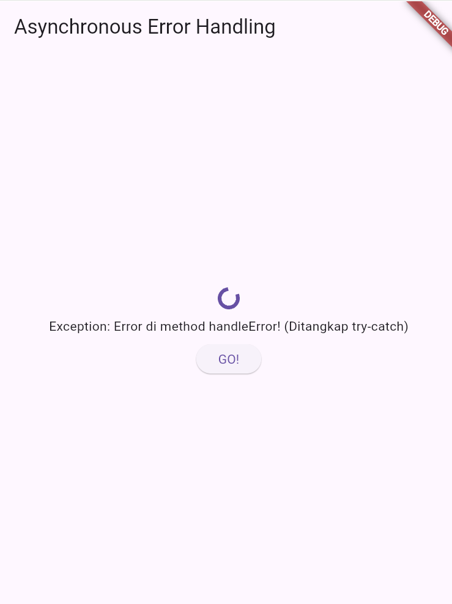
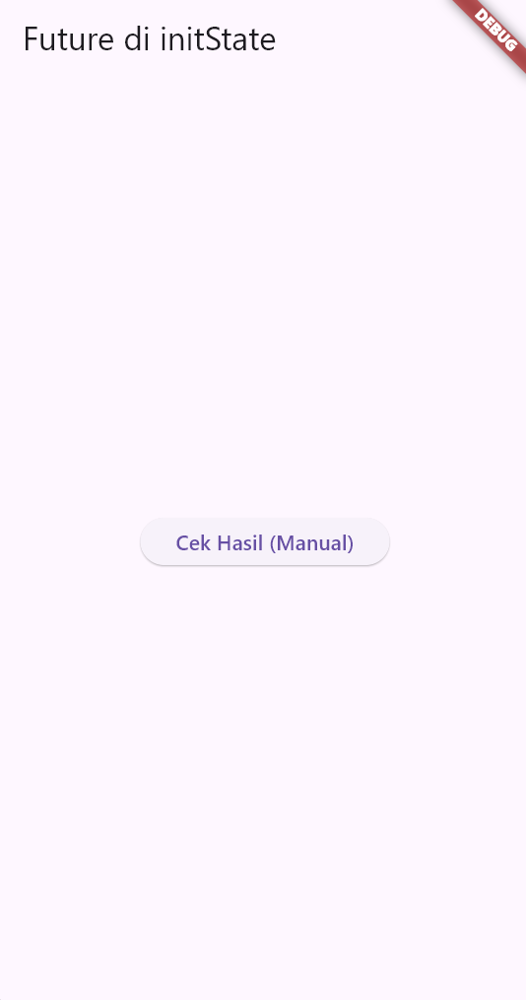
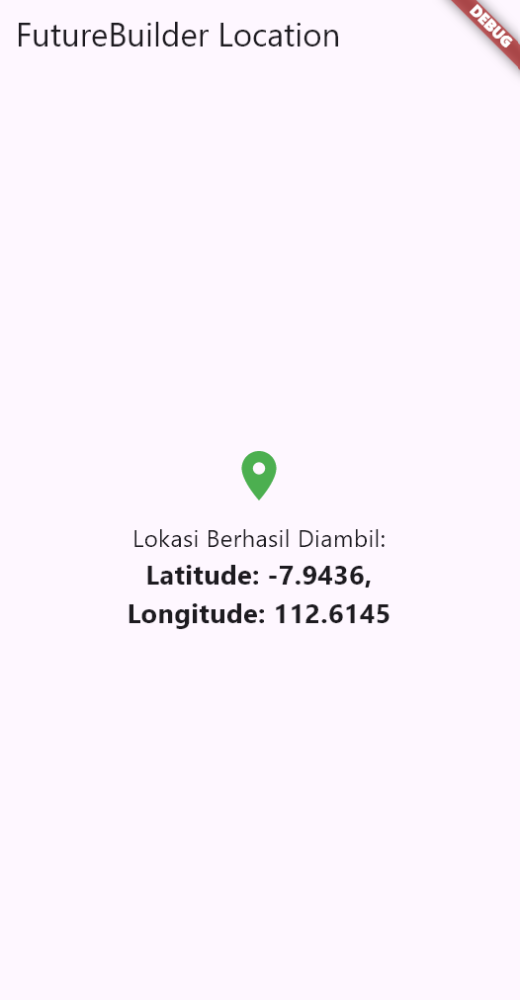
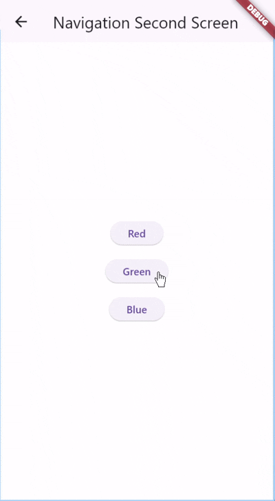
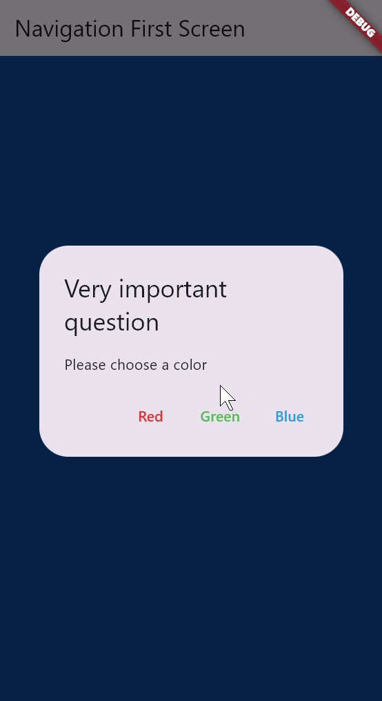

# Jawaban Codelab Flutter: 11 | Pemrograman Asynchronous

## Praktikum 1: Menggunakan Future

<br>

### Soal 1
**Tugas:** Tambahkan nama panggilan Anda pada `title` app sebagai identitas hasil pekerjaan Anda.  
**Jawaban Kode (di `main.dart`):**
```dart
title: 'Books App - [Nama Anda]',
```

### Soal 2
**Tugas:** Ganti ID buku pada variabel path di method getData() dengan ID buku favorit Anda.  
**Jawaban (Konsep):** ID buku (`zyTCAlFPjgYC`) diganti dengan ID buku pilihan (misal: `YlI7EAAAQBAJ`).  
**Jawaban Kode (di main.dart):**
```dart
const String path = 'https://www.googleapis.com/books/v1/volumes/YlI7EAAAQBAJ';
```
Akses URI lengkap di browser (misal: https://www.googleapis.com/books/v1/volumes/YlI7EAAAQBAJ) akan menampilkan data JSON.

### Soal 3
**Jelaskan maksud kode langkah 5 tersebut terkait substring dan catchError!**  
- `.substring(0, 10)`: Digunakan untuk mengambil 10 karakter pertama dari String judul buku.  
- `.catchError((e) { ... })`: Callback untuk menangani error dari Future, misalnya error koneksi.

---

## Praktikum 2: Menggunakan async/await


<br>

### Soal 4
**Langkah 1 dan 2:**
- **Langkah 1:** Fungsi async yang mengembalikan `Future<int>`, menunda eksekusi 3 detik tanpa memblok UI.
- **Langkah 2:** Menggunakan `await` untuk menjalankan ketiga method secara sekuensial → total 9 detik.

---

## Praktikum 3: Menggunakan Completer


<br>
<br>

### Soal 5
**Penjelasan:**  
`Completer` digunakan untuk mengontrol `Future` secara manual. `complete(42)` menandai Future selesai sukses.

### Soal 6
**Perbedaan langkah 2 dengan 5-6:**  
- `complete()` → menyelesaikan Future dengan sukses.  
- `completeError()` → menyelesaikan Future dengan error.  
**Intinya:** satu sukses, satu error.

---

## Praktikum 4: Memanggil Future secara Paralel


<br>

### Soal 7 & 8
**Perbedaan langkah 1 dan 4:**  
- Langkah 1: Future dijalankan sekuensial → 9 detik.  
- Langkah 4: `Future.wait` → paralel → 3 detik total.

---

## Praktikum 5: Penanganan Error pada Kode Asynchronous


<br>

### Soal 9
**Hasil:** Saat `throwException().then().catchError()` dipanggil, muncul pesan error di UI dan log “Complete”.

### Soal 10
**Perbedaan:**

| Fitur | Langkah 1 (.catchError) | Langkah 4 (try-catch async) |
| :--- | :--- | :--- |
| Mekanisme | Error di luar method | Error di dalam method |
| Sintaks | Callback chaining | Sequential async/await |
| Keterbacaan | Terpisah dari logika | Terintegrasi dalam logika |

---

## Praktikum 6: Future dengan StatefulWidget


<br>
<br>

### Soal 11
- `_determinePosition()`: Mendapatkan posisi perangkat dengan izin lokasi async.  
- `initState()`: Menyimpan Future agar tidak dijalankan ulang di setiap `build()`.

---

## Praktikum 7: Menggunakan FutureBuilder


<br>

### Soal 12
`FutureBuilder` membangun UI berdasarkan status Future.  
- `waiting`: Loading  
- `hasError`: Gagal  
- `hasData`: Berhasil  

---

## Praktikum 8: Navigasi Route Asynchronous


<br>

### Soal 13
- `_showNextPage()`: async, menunggu `Navigator.push()` hingga `pop`.  
- `onPressed`: menggunakan `.then()` untuk menangkap hasil navigasi (true/false).

---

## Praktikum 9: Mengambil Hasil dari Dialog

<br>

### Soal 14
- `_showDialog()`: async, menunggu `showDialog` hingga user menekan tombol.  
- `onPressed`: menangkap hasil dialog (`value`) dari `Navigator.pop()`.  
