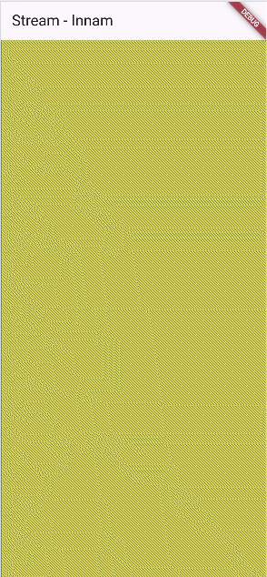
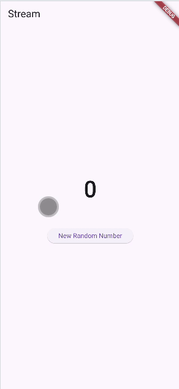
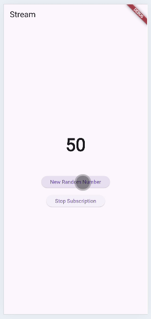
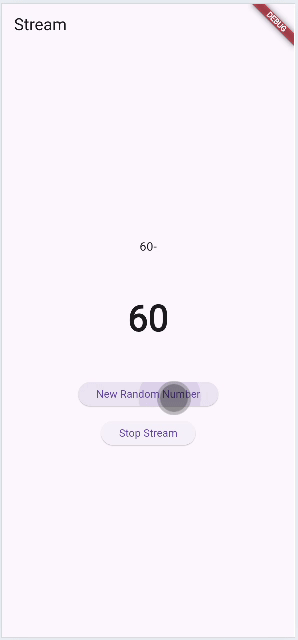
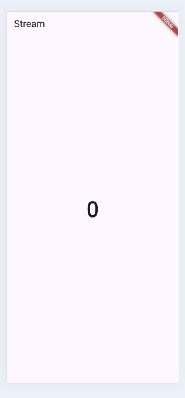
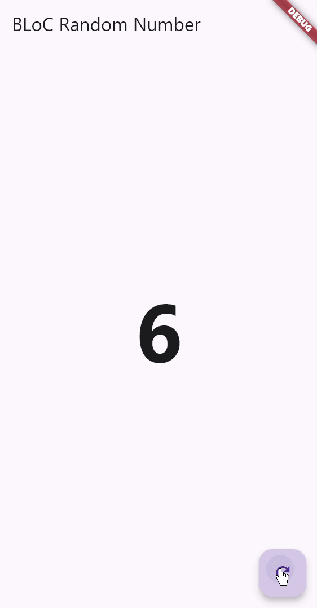

# Laporan Praktikum Flutter: State Management dengan Streams dan BLoC

**Nama:** Innama Maesa Putri
**Materi:** Streams, StreamControllers, StreamTransformers, StreamBuilder, dan BLoC Pattern  

---

## Praktikum 1: State Management dengan Streams (Color Stream)

 

### Soal 1
Tambahkan nama panggilan Anda pada title app sebagai identitas hasil pekerjaan Anda.  
Gantilah warna tema aplikasi sesuai kesukaan Anda.  

**Jawaban:**  
Tema aplikasi diganti menjadi `Colors.deepPurple` dan title AppBar ditambahkan identitas.  

**Commit:** `W12: Jawaban Soal 1`

---

### Soal 2
Tambahkan 5 warna lainnya sesuai keinginan Anda pada variabel `colors` di stream.dart.  

**Jawaban:**  
5 warna tambahan (`Red`, `Green`, `Indigo`, `Pink`, `Brown`) telah ditambahkan ke variabel `colors`.  

**Commit:** `W12: Jawaban Soal 2`

---

### Soal 3
Jelaskan fungsi keyword `yield*` pada kode tersebut!  

| Keyword/Kode | Penjelasan |
|--------------|------------|
| `yield*` | Digunakan dalam fungsi generator asinkron (`async*`). Fungsinya untuk mengirimkan semua nilai dari stream yang dihasilkan secara langsung ke stream output dari fungsi `getColors()`. Setara dengan melakukan `await for` pada stream dan menghasilkan (`yield`) setiap elemennya satu per satu. |
| `Stream.periodic(...)` | Membuat stream yang menghasilkan event secara berkala setiap 1 detik. Callback `(int t)` menerima hitungan waktu, digunakan untuk menentukan indeks warna `(index = t % colors.length)`, memastikan urutan warna berulang. |

**Commit:** `W12: Jawaban Soal 3`

---

### Soal 4
Capture hasil praktikum Anda berupa GIF dan lampirkan di README.  

**Jawaban:** *[Lampirkan GIF]*  

**Commit:** `W12: Jawaban Soal 4`

---

### Soal 5
Jelaskan perbedaan menggunakan `listen` dan `await for`.  

| Fitur | `stream.listen((event) { ... })` | `await for (var event in stream) { ... }` |
|-------|---------------------------------|-----------------------------------------|
| Asinkronisitas | Non-Blokir (Non-Blocking). Metode callback. Program utama tidak terhenti. | Blokir (Blocking). Program berhenti sampai setiap event diterima dan diproses. |
| Pengelolaan | Mengembalikan `StreamSubscription`, memungkinkan kontrol manual (`pause()`, `resume()`, `cancel()`). | Tidak memiliki kontrol eksternal mudah. Digunakan di dalam fungsi async. |
| Penggunaan | Ideal untuk UI (`initState()`) karena tidak memblokir thread utama. | Ideal untuk konsumsi data sekali jalan atau pemrosesan data non-UI. |

**Commit:** `W12: Jawaban Soal 5`

---

## Praktikum 2: Streams Controllers dan Sinks (Random Number)

 

### Soal 6
Jelaskan maksud kode langkah 8 dan 10.  

| Langkah | Kode | Maksud |
|---------|------|--------|
| Langkah 8 | `numberStream.stream.listen((number) { setState(() { lastNumber = number; }); });` | Listener yang mendengarkan data dari stream. Setiap angka baru diterima, `setState()` memperbarui UI. |
| Langkah 10 | `numberStream.addNumberToSink(myNum);` | Input data ke stream melalui sink. Memicu listener pada Langkah 8. |

**Jawaban:** *[Lampirkan GIF]*  

**Commit:** `W12: Jawaban Soal 6`

---

### Soal 7
Jelaskan maksud kode langkah 13 sampai 15.  

| Langkah | Kode | Maksud |
|---------|------|--------|
| Langkah 13 | `addError()` | Mengirim error ke stream alih-alih data biasa. |
| Langkah 14 | onError pada listen | Callback dijalankan ketika error diterima, menampilkan `lastNumber = -1` dan log error. |
| Langkah 15 | Komentar `addNumberToSink()` dan pemanggilan `addError()` | Menunjukkan stream dapat membawa data maupun error secara asinkron. |

**Commit:** `W12: Jawaban Soal 7`

---

## Praktikum 3: Stream Transformers (Data Manipulation)

 

### Soal 8
Jelaskan maksud kode langkah 1-3.  

| Langkah | Kode | Maksud |
|---------|------|--------|
| Langkah 1-2 | Inisialisasi `StreamTransformer` | Transformer dibuat dengan `StreamTransformer.fromHandlers`. `handleData` mengalikan data dengan 10. |
| Langkah 3 | `numberStream.stream.transform(transformer).listen(...)` | Data stream awal di-transform. Misal 0-9 menjadi 0-90, diterima listener, ditampilkan di UI. |

**Jawaban:** *[Lampirkan GIF]*  

**Commit:** `W12: Jawaban Soal 8`

---

## Praktikum 4: Stream Subscription (Control and Termination)

 

### Soal 9
Jelaskan maksud kode langkah 2, 6, dan 8.  

| Langkah | Kode | Maksud |
|---------|------|--------|
| Langkah 2 | `subscription = stream.listen(...)` | Menyimpan referensi listener aktif agar bisa dikontrol manual. |
| Langkah 6 | `subscription.cancel();` di `dispose()` | Menghentikan langganan saat widget dihancurkan untuk mencegah memory leak. |
| Langkah 8 | `if (!subscription.isPaused)` | Memeriksa status langganan sebelum mengirim data atau memanggil fungsi. |

**Jawaban:** *[Lampirkan GIF]*  

**Commit:** `W12: Jawaban Soal 9`

---

## Praktikum 5: Multiple Stream Subscriptions (Broadcast)

 

### Soal 10
Jelaskan mengapa error bisa terjadi.  

**Jawaban:**  
Error `Bad state: Stream has already been listened to` terjadi karena stream default adalah Single-Subscription. Listener kedua memicu error.

---

### Soal 11
Jelaskan mengapa hal itu bisa terjadi.  

**Jawaban:**  
StreamController diubah menjadi `StreamController.broadcast()`. Broadcast Stream mengizinkan banyak listener aktif. Event yang sama diterima dua listener, memperbarui UI di dua lokasi berbeda.

**Commit:** `W12: Jawaban Soal 10,11`

---

## Praktikum 6: StreamBuilder (Reactive UI)
 

### Soal 12
Jelaskan maksud kode langkah 3 dan 7.  

| Langkah | Kode | Maksud |
|---------|------|--------|
| Langkah 3 | `return Stream.periodic(Duration(seconds: 1), (int t) { return t; }).take(10);` | Menghasilkan angka urut 0-9 setiap 1 detik. |
| Langkah 7 | `StreamBuilder<int>` | Widget UI mendengarkan stream secara otomatis, memperbarui tampilan setiap ada event baru. |

**Jawaban:** *[Lampirkan GIF]*  

**Commit:** `W12: Jawaban Soal 12`

---

## Praktikum 7: BLoC Pattern (Separation of Concerns)

 

### Soal 13
Jelaskan maksud praktikum ini. Dimanakah letak konsep pola BLoC-nya?  

**Jawaban:**  
Praktikum ini menunjukkan implementasi sederhana pola BLoC (Business Logic Component) untuk memisahkan logika bisnis dari UI.

| Komponen | Implementasi di Kode | Fungsi dalam Pola BLoC |
|-----------|-------------------|------------------------|
| Input (Events) | `_bloc.eventSink.add(null)` | Mengirim perintah/event dari UI ke BLoC. |
| Business Logic | `RandomNumberBloc` dan `_generateRandomNumber()` | Mendengarkan event, menjalankan logika, menghasilkan state baru. |
| Output (State) | `_bloc.randomStream` | Mengirim state baru melalui stream. |
| Presentasi (UI) | `StreamBuilder` | Mendengarkan state dari BLoC, memperbarui tampilan UI reaktif. |

**Kesimpulan:** Logika bisnis sepenuhnya berada di `random_bloc.dart`, UI hanya berfungsi menampilkan data dan mengirim event. Mencapai prinsip **Separation of Concerns**.

**Commit:** `W12: Jawaban Soal 13`

---
